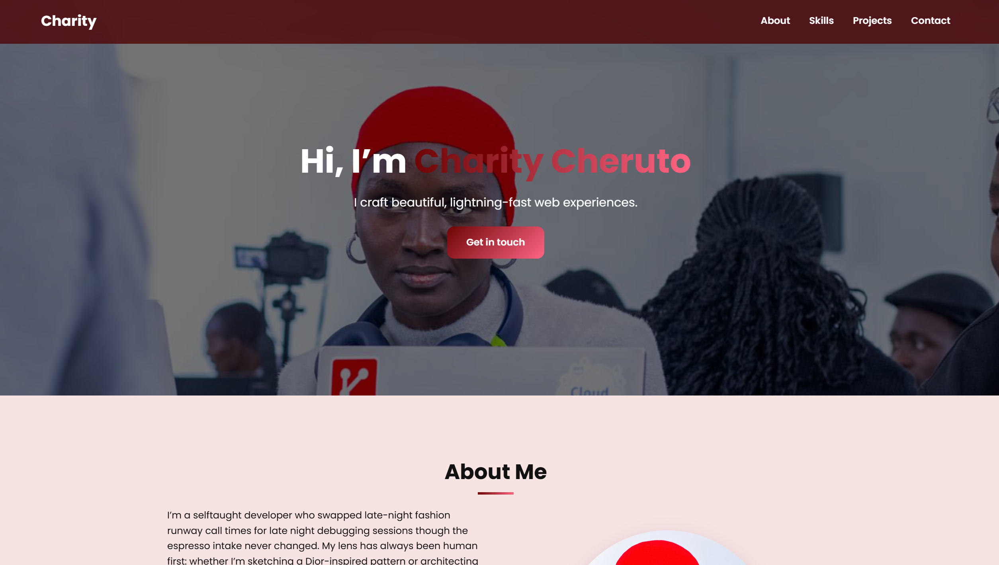
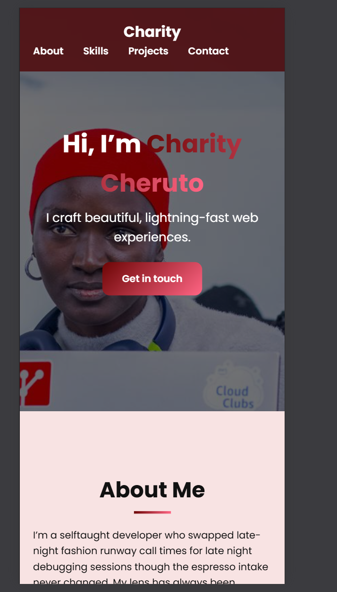

```markdown
# Personal Portfolio – Cheruto Charity  
> **Live demo:** https://Chericheri.github.io/portfolio/

---

## 📌 Overview
This repository contains my **solo-built**, **HTML + CSS only** portfolio website.  
It was created in 4 days (30 Jul – 3 Aug 2025) for the “Portfolio Building Hackathon” and showcases my front-end craftsmanship without any external libraries or frameworks.

---

## 🚀 Quick Start
1. **Clone or download**
   ```bash
   git clone https://github.com/Chericheri/portfolio.git
   cd portfolio
   ```
2. **Open** `index.html` in any modern browser.  
   *(No build tools, no servers, zero dependencies.)*

---

## 🗂️ File map
```
portfolio/
├── index.html        # Single-page markup
├── css/
│   └── style.css     # 1-file design system
└── README.md         # You are here
```
**Total weight:** ≈ 45 KB (HTML 10 KB, CSS 32 KB, images via CSS backgrounds).

---

## 🎯 Design Decisions
| Feature | How it’s done | Purpose |
|---|---|---|
| Responsive grid | CSS Flexbox + Grid | Mobile-first, fluid layout |
| Glass-morphism nav | `backdrop-filter: blur()` | Modern look, accessible |
| Gradient hero | CSS `linear-gradient` + `background-attachment: fixed` | Eye-catching entry |
| Scroll-driven fade-ins | **Removed** – keeps the “no-JS” promise |
| Color tokens | CSS custom properties (`:root`) | Easy theming |

---

## 🧪 Browser Support
- Chrome 90+, Firefox 88+, Safari 14+, Edge 90+  
- All features gracefully degrade on older browsers.

---

## 🎨 Palette & Typography
| Token | Value |
|---|---|
| Primary | `#6C63FF` |
| Accent  | `#FF6584` |
| Dark    | `#222222` |
| Light   | `#F5F5F5` |
| Typeface | Poppins (Google Fonts) |

---

## 📸 Screenshots
!Desktop()  
*Desktop view — 1440 px*

!Mobile()  
*Mobile view — 375 px*

---

## 🛠️ How I built it
| Day | Milestone |
|---|---|
| Day 1 | Wireframes + semantic HTML skeleton |
| Day 2 | Mobile-first CSS layout, color tokens |
| Day 3 | Micro-interactions, accessibility passes |
| Day 4 | Cross-browser tests, README, deploy |

---

## ✅ Accessibility checklist
- [x] Semantic landmarks (`<header>`, `<main>`, `<section>`, `<footer>`)  
- [x] Alt text for all images  
- [x] Focus styles on every interactive element  
- [x] Color-contrast ratio ≥ 7:1 for body text

---

## 🚀 Deployment
GitHub Pages auto-deploys from the `main` branch.  
Push → live in < 30 s.

---

## 🤝 Contribution
This is a personal showcase; issues or suggestions are still welcome!

---

## 📄 License
 © 2025 Cheruto charity
```
